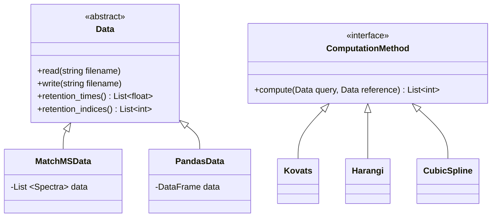

# RIAssigner
RIAssigner is a python tool for retention index (RI) computation for GC-MS data developed at [RECETOX](https://www.recetox.muni.cz/en).

## Class Diagram
<!-- generated by mermaid compile action - START -->

  
Mermaid markup

<!-- generated by mermaid compile action - END -->
