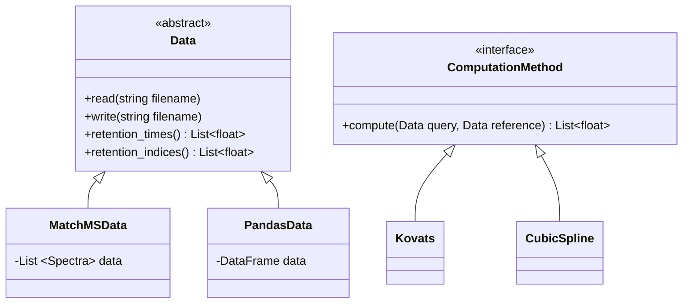

# RIAssigner
[](https://github.com/RECETOX/RIAssigner/actions/workflows/python-package.yml)
[](https://github.com/RECETOX/RIAssigner/actions/workflows/python-package-conda.yml)
[](https://github.com/RECETOX/RIAssigner/actions/workflows/anaconda.yml)
[](https://sonarcloud.io/dashboard?id=hechth_RIAssigner)
[](https://anaconda.org/bioconda/riassigner)

## Overview
RIAssigner is a python tool for retention index (RI) computation for GC-MS data developed at [RECETOX](https://www.recetox.muni.cz/en) and hosted on [Galaxy](https://umsa.cerit-sc.cz/).

The [retention index](https://goldbook.iupac.org/terms/view/R05360) is a mapping of retention time, making the retention data of compounds comparable, i.e. two compounds might have different retention times in different experiments, but a very similar retention index.
To compute this index, a set of reference compounds - often an inert alkane series - is analyzed as part of the batch (on the same column).
The retention index of the alkanes are fixed (carbon number x 100) and any query compounds can be assigned a retention index depending on its retention time.
This can be done via piece wise linear interpolation or other mathematical methods.

## Installation

(1) From source by cloning the repository and then installing the package with `pip`.
```
git clone https://github.com/RECETOX/RIAssigner.git
cd RIAssigner
python -m pip install -e .
```
(2) Install via [bioconda](https://anaconda.org/bioconda/riassigner) in your existing evironment.
```
conda install -c bioconda riassigner
```
(3) Install via [pip](https://pypi.org/project/RIAssigner/) in your existing evironment.
```
pip install riassigner
```

## Usage
RIAssigner can be used to read data from `.msp`, `.csv` and `.tsv` files using [matchms](https://github.com/matchms/matchms) and [pandas](https://pandas.pydata.org/) and to compute the retention indices for the data.
A reference list of retention indexed compounds (traditionally an Alkane series) with retention times is used to compute the RI for a query dataset of retention time values using the [van Den Dool and Kratz](https://doi.org/10.1016/S0021-9673(01)80947-X) method or by using [cubic spline-based interpolation](https://doi.org/10.1021/ac50035a026).
### Example
```python
from RIAssigner.compute import Kovats
from RIAssigner.data import MatchMSData, PandasData

# Load reference & query data
query = PandasData("../tests/data/csv/aplcms_aligned_peaks.csv", "csv", rt_unit="seconds")
reference = MatchMSData("../tests/data/msp/Alkanes_20210325.msp", "msp", rt_unit="min")

# Compute RI and write it back to file
query.retention_indices = Kovats().compute(query, reference)
query.write("peaks_with_rt.csv")
```
For more details check out this [notebook](doc/example_usage.ipynb).

## Developer Documentation
### Setup
Create your development conda environment using the provided [file](conda/environment-dev.yml) to install all required dependencies, including linter and testing frameworks.
```
conda env create -f conda/environment-dev.yml
```

### Contributing
We appreciate contributions - feel free to open an issue on our repository, create your own fork, work on the problem and pose a PR.
Make sure to add your contributions to the [changelog](CHANGELOG.md) and to adhere to the [versioning](https://semver.org/spec/v2.0.0.html).
For more information see [here](CONTRIBUTING.md).
### Architecture
<!-- generated by mermaid compile action - START -->

<details>
  <summary>Mermaid markup</summary>



</details>
<!-- generated by mermaid compile action - END -->

### Testing
All functionality is tested with the [pytest](https://docs.pytest.org/en/6.2.x/contents.html) framework. Make sure to run your IDE in the `riassigner-dev` conda environment (or make sure to use the respective python interpreter when developing) to follow formatting guidelines and to be able to execute the tests.
