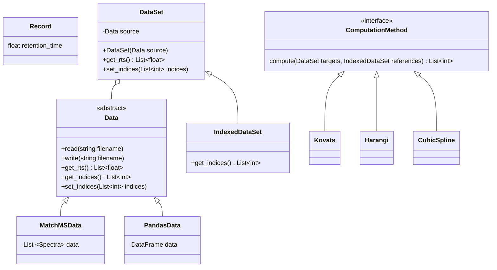

# Class Diagram
<!-- generated by mermaid compile action - START -->

  
Mermaid markup

```mermaid
classDiagram
    class Record {
        float retention_time
    }

    class MatchMSData{
        -List ~Spectra~ data
    }

    class PandasData {
        -DataFrame data
    }

    Data <|-- MatchMSData
    Data <|-- PandasData

    class Data{
        <<abstract>>
        +read(string filename)
        +write(string filename)
        +get_rts() List~float~
        +get_indices() List~int~
        +set_indices(List~int~ indices)
    }

    class DataSet{
        -Data source
        +DataSet(Data source)
        +get_rts() List~float~
        +set_indices(List~int~ indices)
    }

    DataSet o-- Data

    class IndexedDataSet{
        +get_indices() List~int~
    }

    DataSet <|-- IndexedDataSet

    class ComputationMethod{
        <<interface>>
        compute(DataSet targets, IndexedDataSet references) List~int~

    }

    class Kovats {

    }
    class Harangi {

    }
    class CubicSpline {

    }

    ComputationMethod <|-- Kovats
    ComputationMethod <|-- Harangi
    ComputationMethod <|-- CubicSpline

```

<!-- generated by mermaid compile action - END -->
